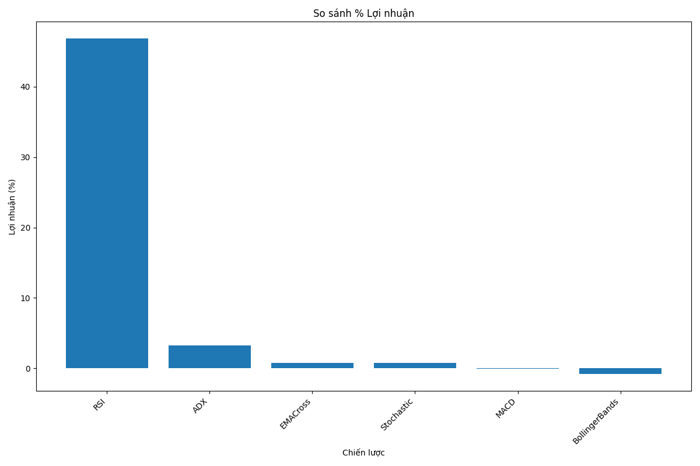
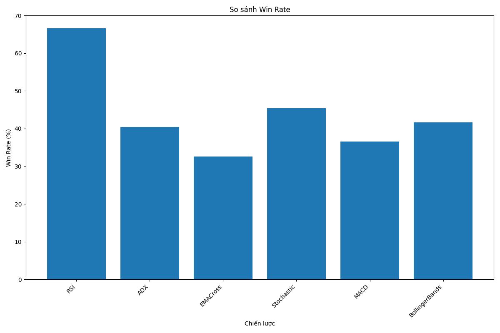
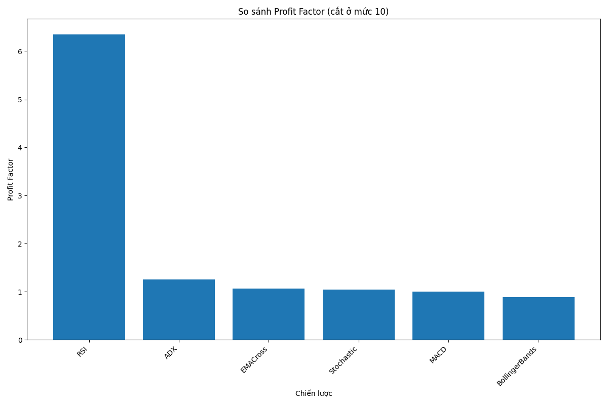

# BÁO CÁO HIỆU SUẤT HỆ THỐNG GIAO DỊCH BITCOIN
Ngày tạo: 2025-03-02 00:40:45

## 1. Thống kê tổng quát

- Tổng số giao dịch: 1430
- Tổng lợi nhuận: $2030.81
- Win Rate trung bình: 43.89%
- Chiến lược tốt nhất: RSI (46.85%)
- Chiến lược kém nhất: BollingerBands (-0.83%)

## 2. So sánh chi tiết các chiến lược

| Chiến lược     |   Số giao dịch | Win Rate   | Lợi nhuận %   |   Profit Factor | Lãi TB   | Lỗ TB   |
|:---------------|---------------:|:-----------|:--------------|----------------:|:---------|:--------|
| RSI            |              9 | 66.67%     | 46.85%        |            6.36 | $252.48  | $-79.40 |
| ADX            |            131 | 40.46%     | 3.26%         |            1.25 | $126.35  | $-68.55 |
| EMACross       |            181 | 32.60%     | 0.79%         |            1.07 | $112.78  | $-51.12 |
| Stochastic     |            152 | 45.39%     | 0.78%         |            1.04 | $116.60  | $-92.90 |
| MACD           |            350 | 36.57%     | -0.02%        |            1    | $73.90   | $-42.70 |
| BollingerBands |            607 | 41.68%     | -0.83%        |            0.89 | $41.68   | $-33.54 |

## 3. Phân tích theo chế độ thị trường

Không có dữ liệu về chế độ thị trường

## 4. Biểu đồ phân tích

### So sánh lợi nhuận các chiến lược

### So sánh Win Rate của các chiến lược

### So sánh Profit Factor của các chiến lược

## 5. Kết luận và Khuyến nghị

### Chiến lược tốt nhất: RSI
- Lợi nhuận: 46.85%
- Win Rate: 66.67%
- Profit Factor: 6.36
- Số giao dịch: 9

### Khuyến nghị:
2. Sử dụng chiến lược RSI làm chiến lược chính
3. Đánh giá lại và điều chỉnh các tham số để cải thiện hiệu suất
4. Tiếp tục cải thiện quản lý rủi ro để giảm drawdown