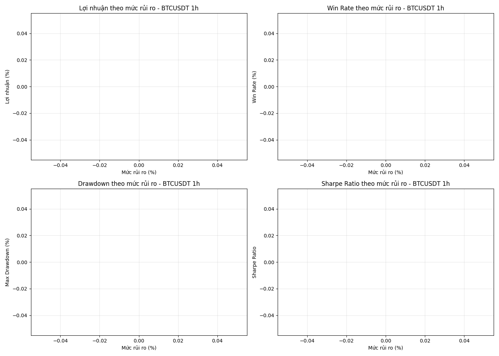

# Báo cáo phân tích rủi ro cho BTCUSDT 1h

*Ngày tạo: 2025-03-06 15:53:26*

## Tổng quan

- **Cặp giao dịch:** BTCUSDT
- **Khung thời gian:** 1h
- **Dữ liệu:** 3 tháng gần nhất
- **Số mức rủi ro được kiểm thử:** 5

## So sánh hiệu suất các mức rủi ro

| Mức rủi ro | Lợi nhuận (%) | Win Rate (%) | Drawdown (%) | Sharpe Ratio | Số lệnh | Trade/Ngày |
|------------|--------------|--------------|--------------|--------------|---------|------------|

## Kết luận phân tích

### Mức rủi ro tối ưu

### Khuyến nghị

✅ **Khuyến nghị sử dụng mức rủi ro 0%** - đây là mức tối ưu cả về lợi nhuận và giảm thiểu drawdown.

### Ghi chú

Các mức rủi ro cao hơn có thể mang lại lợi nhuận lớn hơn, nhưng cũng kèm theo drawdown lớn hơn. Mức rủi ro tối ưu phụ thuộc vào khẩu vị rủi ro và mục tiêu giao dịch của nhà đầu tư.

